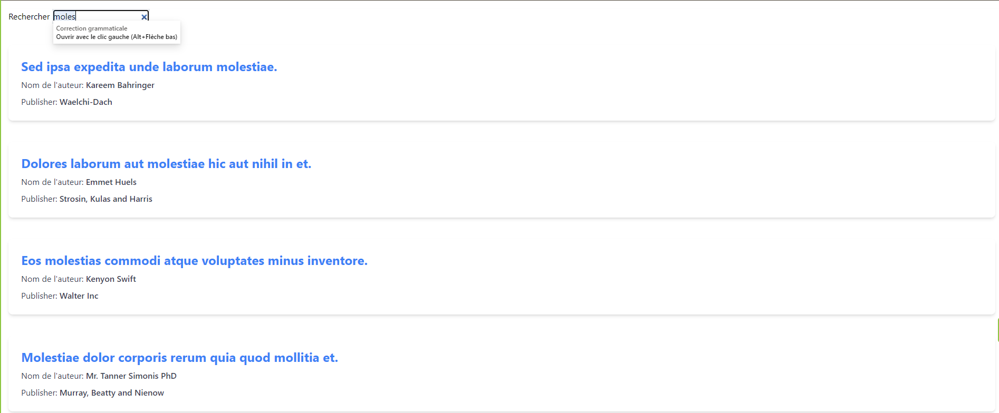

### POC Typesense

## Pré-requis

```bash
- PHP 8.3
- Docker
- Node LTS et Yarn
```

## Installation

```bash
git clone git@github.com:thedevopser/typesense.git
cd typesense
composer install
yarn install
yarn run build
docker compose up -d
php bin/console d:m:m
php bin/console doctrine:fixtures:load ## Prend quelques minutes voir heures, soyez patient
php bin/console typesense:create
php bin/console typesense:import
```

## Utilisation 

Lancer le serveur interne Symfony (`symfony server:start`) ou créer un Vhost pour votre application.

Naviguez vers la page `/search` et dans l'input faite votre recherche (attention la génération ets faite par Faker donc ça sera du lorem qui sera généré)

